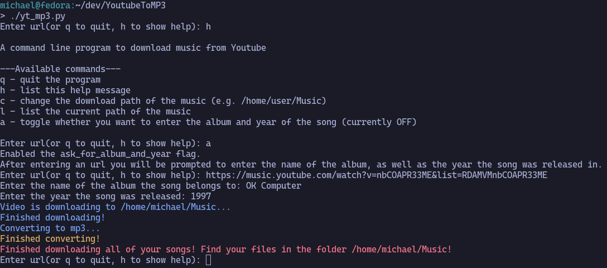

# YoutubeToMP3



A program that converts a Youtube/YoutubeMusic link to a music mp3 file while adding useful metadata (name of artist, song title, year, album). It is written in python using the pytube module. It works best for Debian, Arch Linux and Fedora systems because of the provided instructions for installing all of the needed dependencies. But if you are able to make it work on Windows or other Linux Distributions then go for it!

## Important
- If downloading a **playlist** from Youtube it must either be **public** or **unlisted** for the program to work.
- If you get any download related errors try to update the pytube library with the following command.

	```sh
	pip3 install --upgrade --force-reinstall "git+https://github.com/pytube/pytube.git"
	```

## Installing
1. Clone the repository.

	```sh
	git clone https://github.com/MichiTheGenius/YoutubeToMP3
	```

2. Move into the new directory.

	```sh
	cd YoutubeToMP3
	```

3. Follow the instructions depending on your Linux Distribution to install the need dependencies.

### Debian
```bash
sudo apt update
sudo apt install ffmpeg python3 python3-pip
pip3 install pytube numpy
```

### Fedora
```bash
sudo dnf update
sudo dnf install ffmpeg-free python3 python3-pip
pip3 install pytube numpy
```

### Arch
```bash
sudo pacman -Sy ffmpeg python3 python3-pip
pip3 install pytube numpy
```

## Usage
### Single video/playlist (combined)
This is the recommended script for downloading single songs or complete playlists. It automatically determines whether it is a single song or a playlist you want to download.
```sh
python yt_mp3.py
OR
./yt_mp3.py
```
---

### Multithreading (experimental)
This is basically the same script as the one before, except it uses multithreading. I just added it to learn a bit about threading in python. 
```sh
python yt_threading.py
```
---
   
- After running one of the scripts the program prompts you to create a path file with the `c` command. Enter the path where you want to save your music. (e.g. /home/user/Music)
- After creating your path file you can start by entering an url of your song right away or explore the **help** with the `h` command.

## Notes
- The program automatically adds the artist's name as well as name of the song to your mp3. Due to YouTube's limitations it is not able to fetch other data like the name of the album or the year the song was released in. That is why the program implements a toggle that lets you chose whether you want to manually enter the album and year of the song. To use this toggle enter `a` in the url field.

- The indices asked from the playlist asked are the small numbers on the left of a playlist video.

- Simply choose the start and end video end everything in between will be downloaded.
